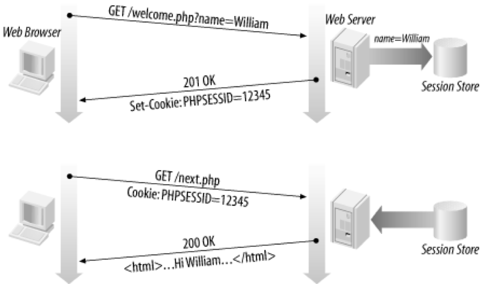

# Using sessions in Flask

## Introduction to sessions

### What are sessions?

'Session' is an abstract concept to represent a series of HTTP requests and responses between a specific web browser and
server. HTTP doesn't support the notion of a session, but Python does.

A cookie is data stored on the client; a session's data is stored on the server (only 1 session per client).

Sessions are often built on top of cookies. The only data the client stores is a cookie holding a unique session ID on
each page request, the client sends its session ID cookie, and the server uses this to find and retrieve the client's
session data.

### How sessions are established



- Client's browser makes an initial request to the server.
- Server notes client's IP address/browser, stores some local session data, and sends a session ID back to client
- Client sends that same session ID back to server on future requests
- Server uses session ID to retrieve the data for the client's session later

### Sessions in Flask

[Sessions in Flask](https://flask.palletsprojects.com/en/1.1.x/quickstart/#sessions) are a way to store information
about a specific user from one request to the next. They work by storing a cryptographically signed cookie on the users
browser and decoding it on every request.

The session object can be treated just like a dictionary that persists across requests, making it an ideal place to
store non-sensitive user data.

The user could look at the contents of your cookie but not modify it, unless they know the secret key used for signing.

However, the session object is NOT a secure way to store data. It's a base64 encoded string and can easily be decoded,
thus not making it a secure way to save or access sensitive information. An example of decoding the session data is
shown at the end
of [this tutorial by Julian Nash on pythonise.com](https://pythonise.com/series/learning-flask/flask-session-object).

### Using sessions in Flask

You must set a Flask `SECRET_KEY' to use sessions e.g. in config.py:

```python
app.config["SECRET_KEY"] = 'my_secret_key'
# or
app.secret_key = 'my_secret_key'
```

To generate your own secret_key try the following in a Python console:

```python
import secrets

secrets.token_urlsafe(16)
```

For a production server you would also want to make the `SESSION_COOKIE_SECURE = True` to send cookie using secure HTTP

You then implement sessions using code similar to the following:

```python
# Import sessions from flask:
from flask import session

# Set session data: 
session['username'] = request.form['username’]
# Get session data: 
session['username’]
# Delete a session data: 
session.pop('username’)
```

## Using sessions - examples

**Note**: You are unlikely to need to create sessions explicitly in the coursework. Flask-Login uses sessions however it
creates and manages these for you.

There are plenty of freely available Flask sessions tutorials. Code
from [Flask Sessions](https://testdriven.io/blog/flask-sessions/) has been created in sessions.py if you want to follow
the tutorial and experiment with it.
