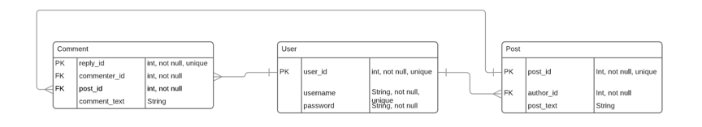

# Flask database interaction using Flask-SQLAlchemy part 2: Relationships, Queries, handling errors

This exercise covers queries and relationships in SQLAlchemy with a focus on the query syntax.

It uses only a very simple Flask app. The app config, models and routes are all contained in app.py for ease - you
shouldn't use this structure for your coursework.

## Create the model classes for the tables

Consider the following ERD:



The classes and attributes be created as follows:

```python
class User(db.Model):
    __tablename__ = "user"
    user_id = db.Column(db.Integer, primary_key=True)
    username = db.Column(db.Text, nullable=False)
    password = db.Column(db.Text, nullable=False)

    def __repr__(self):
        return f"{self.id} {self.first_name} {self.last_name} {self.email} {self.password}"


class Post(db.Model):
    __tablename__ = "post"
    post_id = db.Column(db.Integer, primary_key=True)
    author_id = db.Column(db.Integer, nullable=False)
    post_title = db.Column(db.Text, nullable=False)
    post_text = db.Column(db.Text, nullable=False)
    
    def __repr__(self):
        return '<Post %r>' % self.post_text


class Comment(db.Model):
    __tablename__ = "comment"
    comment_id = db.Column(db.Integer, primary_key=True)
    commenter_id = db.Column(db.Integer, nullable=False)
    post_id = db.Column(db.Integer, nullable=False)
    comment_text = db.Column(db.Text, nullable=False)

    def __repr__(self):
        return '<Comment %r>' % self.comment_text

```

## Add the relationships

While the classes and tables now have the columns defined, they do not yet have the relationships.

A [simple one to may relationship](https://flask-sqlalchemy.palletsprojects.com/en/2.x/quickstart/#simple-relationships)
could be implemented like this:

```python
from database_example import db


class User(db.Model):
    __tablename__ = "user"
    user_id = db.Column(db.Integer, primary_key=True)
    username = db.Column(db.Text, nullable=False)
    password = db.Column(db.Text, nullable=False)
    posts = db.relationship("Post", backref=db.backref('user'))
    comments = db.relationship("Comment", backref=db.backref('user'))

    def __repr__(self):
        return f"{self.id} {self.first_name} {self.last_name} {self.email} {self.password}"


class Post(db.Model):
    __tablename__ = "post"
    post_id = db.Column(db.Integer, primary_key=True)
    author_id = db.Column(db.Integer, db.ForeignKey('user.user_id'), nullable=False)
    post_title = db.Column(db.Text, nullable=False)
    post_text = db.Column(db.Text, nullable=False)
    comments = db.relationship("Comment", backref=db.backref('post'))

    def __repr__(self):
        return '<Post %r>' % self.post_text


class Comment(db.Model):
    __tablename__ = "comment"
    comment_id = db.Column(db.Integer, primary_key=True)
    commenter_id = db.Column(db.Integer, db.ForeignKey('user.user_id'), nullable=False)
    post_id = db.Column(db.Integer, db.ForeignKey('post.post_id'), nullable=False)
    comment_text = db.Column(db.Text, nullable=False)

    def __repr__(self):
        return '<Comment %r>' % self.comment_text

```

## Other relationship types

The above syntax creates
a [one to many relationship](https://docs.sqlalchemy.org/en/14/orm/basic_relationships.html#many-to-one). SQLAlchemy
however provides for other relationship types and these
are [explained in their documentation](https://docs.sqlalchemy.org/en/14/orm/basic_relationships.html).

Relational databases don't support many-to-many relationships, so in COMP0035 you were encouraged to add a new table
between the two tables that takes the PK from each of those tables as FK in the 'middle' table. Flask-SQLAlchemy allows
you to define an [association table](https://docs.sqlalchemy.org/en/14/orm/basic_relationships.html#many-to-many)
instead so you may wish to investigate that.

## Create the database

To create the database use the Flask-SQLAlchemy `create_all()` method. You previously added this code to
the `create_app()`
function which we aren't using in this example, so instead use the command line.

Note that the command syntax for creating the Users, Comments, Posts and adding them to the database will be the same if
you added them to a python file rather than entering them at the command line so you can use the same syntax in your
routes of your app.

Go to the terminal in your project.

Enter `python3`

At the `>>>` prompt enter the following sequence of commands:

```shell
from database_example.app import db, User, Post, Comment
db.create_all()
```

## Flask-SQLAlchemy query syntax

This exercise will create two users: u1 and u2. User u1 creates a post. User u2 comments on the post.

For this we will use a python console in the project to interact with the database. You would not do this in your
coursework, you would use forms in views, however this is just to illustrate the query syntax.

To create two users using the User model in `app.py` enter the follow sequence of commands one line at a time at
the `>>>` prompt:

```shell
u1 = User(username='uname1', password='password1')
u2 = User(username='uname2', password='password2')
```

Now that you have a couple of users, create a Post and append it to the u1 user. SQLAlchemy provides functions to allow
you to work
with [related objects](https://docs.sqlalchemy.org/en/14/tutorial/orm_related_objects.html#working-with-related-objects)
.

Enter the following sequence to add a post to user u1:

```shell
p1 = Post(post_title='title1', post_text='Some text for post 1')
u1.posts.append(p1)
```

Now create a comment on the post from user u2. Two relationships exist for the comments, with user and post. Enter:

```shell
c1 = Comment(comment_text="Some comment on post 1")
u2.comments.append(c1)
p1.comments.append(c1)
```

To create the records in the database you need to use the SQLAlchemy database object (called `db` in `app.py`).

You can either use `db.session.add(u1)` to add a single object; or `db.session.add_all([])` to add multiple objects.

You then 'commit' the changes to the database using `db.session.commit()`

Enter the following sequence of commands:

```shell
db.session.add_all([u1, u2])
db.session.commit()
```

## Finding users and posts

SQLAlchemy provides methods that will generate the SQL on execution. Try the following:

```shell
User.query.all()
Post.query.first()
Comment.query.all()
User.query.filter_by(username='uname1').first()
Post.query.filter(User.username.contains('uname'), User.user_id == Post.author_id).all()
# create variables with the objects in the query results e.g.
post = Post.query.first()
print(f"Title: {post.post_title} \nPost: {post.post_text}")
users = User.query.all()
[print(u.password) for u in users]
```

In your routes you will likely to want to either capture data input from users and save it to the database (as shown in
week 7 activity 4) or to query the database to return a list of results (as shown in week 8 activity 3).

## Handling database errors and error messages

You can use one or more techniques:

- Flask-SQLAlchemy provides methods for returning a 404 error which is useful to use in a route (view). For example,
  instead of `get()` in a query, use `get_or_404()`; or `first_or_404()` instead of `first()`. This will raise 404
  errors instead of returning None.
- Explore [Flask error handling](https://flask.palletsprojects.com/en/2.0.x/errorhandling/) and custom error messages.
- Explore using Flask-WTF validation to catch errors custom validation method in a FlaskForm using Flask-WTF Validation
  error e.g.

```python
def validate_email(self, email):
    users = User.query.filter_by(email=email.data).first()
    if users is not None:
        raise ValidationError('An account is already registered for that email address')
```

- Use python's `try / except` and raise specific [SQLAlchemy errors](https://docs.sqlalchemy.org/en/14/errors.html) e.g.
  ```python
  from sqlalchemy.exc import IntegrityError
    
  user = User('...params here...')
  try:
      db.session.add(user)
      db.session.commit()
  except IntegrityError:
      db.session.rollback()
  ```

## Further examples

- [Intro to Flask-SQLAlchemy queries (video)](https://www.youtube.com/watch?v=JKoxrqis0Co)
- [Flask SQLAlchemy simple queries](https://www.kevin7.net/post_detail/flask-sqlalchemy-simple-queries) - includes joins and querying many to many relationships
- [Miguel Grinberg's chapter on databases](https://blog.miguelgrinberg.com/post/the-flask-mega-tutorial-part-iv-database)
- [Hackers and Slackers post on SQLAlchemy relationships](https://hackersandslackers.com/sqlalchemy-data-models/)
- [Patrick Kennedy on database relationships](https://www.patricksoftwareblog.com/database-relationships/)
